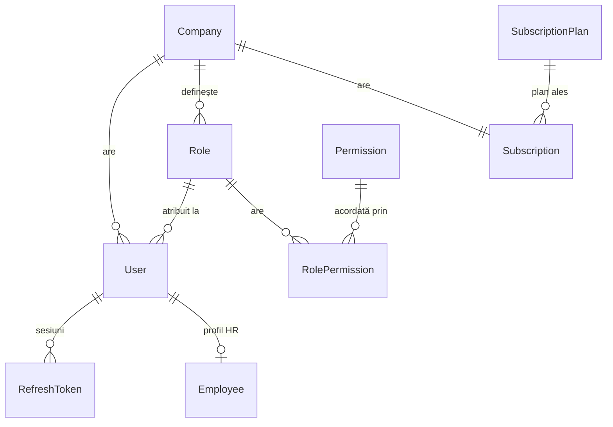
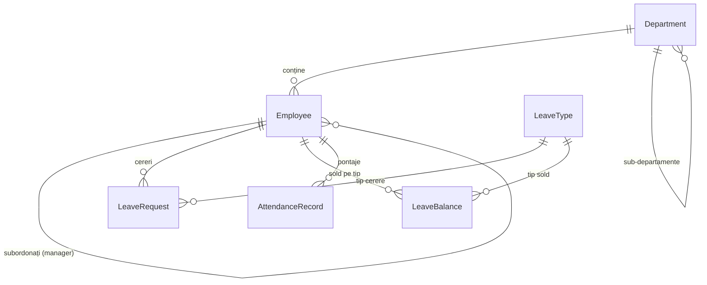
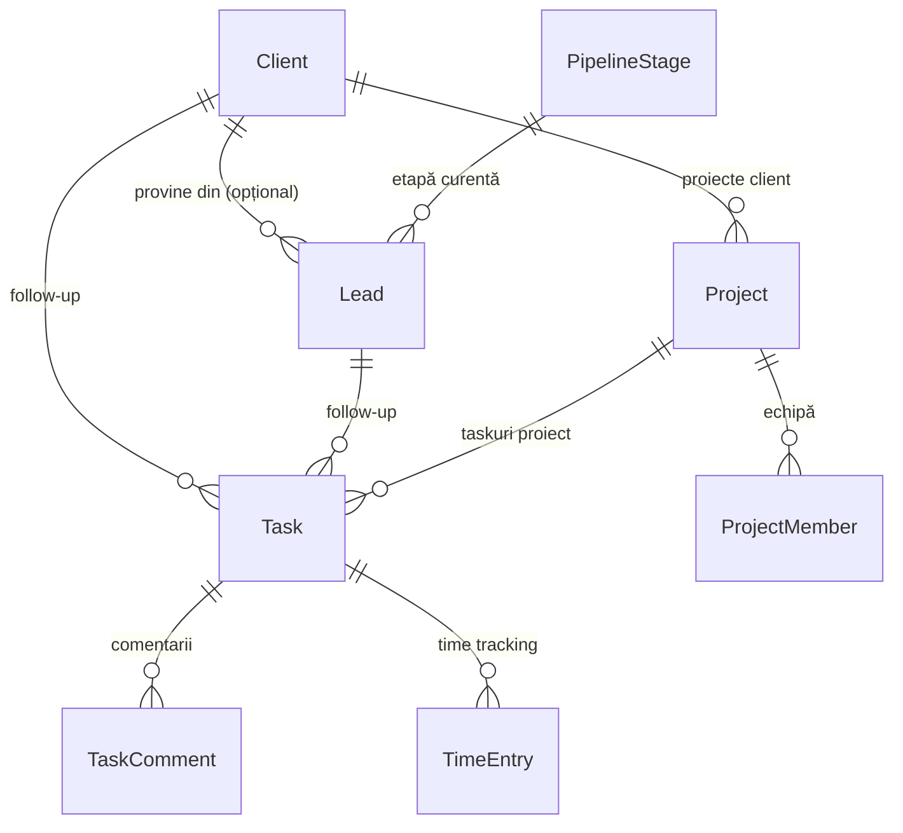
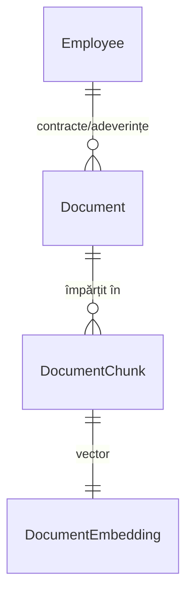

# Bază de date — WorkSphere

Schema completă: [`packages/database/prisma/schema.prisma`](../packages/database/prisma/schema.prisma)
(fiecare model are un comentariu `///` care explică rolul lui — acest
document explică **relațiile dintre tabele** și deciziile structurale.

## Convenția multi-tenant

Orice tabel marcat `[TENANT]` în schema Prisma are o coloană `companyId`
obligatorie. Izolarea se aplică pe două niveluri:

1. **Aplicație**: `TenantAwarePrismaService` injectează automat
   `WHERE companyId = :current` pe orice query către un model tenant-scoped,
   folosind `companyId`-ul din `AsyncLocalStorage` (populat din JWT la
   fiecare request de `TenantContextMiddleware`).
2. **Bază de date (defense-in-depth)**: fiecare tabel `[TENANT]` are Row
   Level Security activat:

```sql
ALTER TABLE employees ENABLE ROW LEVEL SECURITY;

CREATE POLICY tenant_isolation ON employees
  USING (company_id = current_setting('app.current_company_id')::text);
```

`app.current_company_id` este setat la începutul fiecărei tranzacții
(`SET LOCAL app.current_company_id = '...'`) de `PrismaService`, imediat
după deschiderea conexiunii din pool. Astfel, chiar dacă un query din
aplicație ar omite din greșeală filtrul `companyId`, Postgres refuză să
returneze rânduri din altă companie.

## Diagrame ER (grupate pe modul, pentru lizibilitate)

### Auth, RBAC & Companie



- **User vs Employee**: `User` = identitate de autentificare (email, parolă,
  rol, 2FA). `Employee` = extensia HR (departament, contract, superior
  ierarhic, sold concediu). Separarea permite conturi fără profil HR
  complet (ex. un contabil extern) fără a forța câmpuri HR irelevante.
- **Role** e per-companie (nu global) ca să permită roluri custom;
  `Role.systemKey` marchează rolurile seed-uite automat (ADMIN, MANAGER,
  HR, ACCOUNTANT, EMPLOYEE) care nu pot fi șterse.
- **RefreshToken** e opac (nu JWT) tocmai ca să poată fi revocat individual
  din DB — vezi `ARCHITECTURE.md §3`.

### HR — Departamente, Concedii, Pontaj



- **LeaveBalance** e un tabel separat de suma cererilor aprobate — sold
  precalculat per (angajat, tip concediu, an), actualizat la aprobare.
  Motiv: întrebarea AI "câte zile mai are Andrei?" trebuie să răspundă
  instant, fără a recalcula toate cererile istorice.
- **AttendanceRecord** ține `checkInLat/Lng` și `checkOutLat/Lng` separat
  (geolocația poate diferi la intrare vs. ieșire) — nullable, pentru că
  geolocația e opțională conform cerințe.

### CRM & Proiecte (Task reutilizat cross-modul)



- **Task e un singur model** folosit atât de modulul Proiecte
  (`projectId` completat) cât și de CRM (`clientId`/`leadId` completat
  pentru follow-up) cât și de Calendar (task de sine stătător, fără nicio
  FK completată). Alternativa — 3 modele separate (`ProjectTask`,
  `CrmFollowUp`, `CalendarTask`) — ar tripla logica de status/prioritate/
  comentarii/atașamente fără beneficiu real.

### Documente & AI (RAG)



- Fluxul RAG: la upload, documentul e împărțit în `DocumentChunk` (~500-1000
  tokeni), fiecare chunk primește un `DocumentEmbedding` (vector 1536-dim,
  `pgvector`). Întrebările AI Assistant declanșează o căutare de
  similaritate cosine peste `document_embeddings`, filtrată tot prin RLS
  (`company_id` derivat prin join cu `Document`), deci AI-ul nu poate
  "vedea" niciodată documentele altei companii.

## Denumiri care ar putea crea confuzie (clarificate explicit)

- **`Invoice` (mapat `subscription_invoices`)** = factura de abonament
  SaaS emisă de platformă către companie (sincronizată din Stripe).
  Facturile pe care o companie le emite propriilor clienți (modulul CRM)
  nu sunt încă modelate — vor fi adăugate ca `SalesInvoice` când se
  implementează facturarea electronică e-Factura (vezi `ROADMAP.md`),
  pentru a nu amesteca cele două concepte sub același nume de tabel.

## Migrații

Migrațiile Prisma trec prin `packages/database/prisma/migrations/`. Prima
migrație (`0001_init`) creează schema completă; a doua migrație
(`0002_enable_rls`) e SQL manual (nu generat de Prisma) care activează RLS
pe toate tabelele `[TENANT]` — Prisma nu suportă generarea de politici RLS
nativ, deci acest fișier e scris manual și verificat la fiecare schimbare
de schema.
